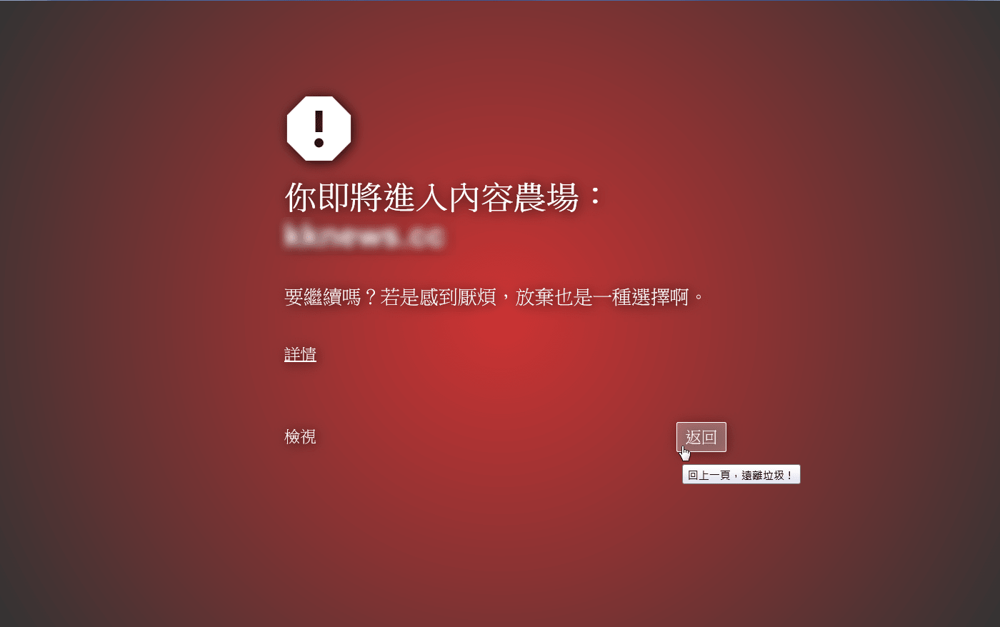

終結內容農場 (Content Farm Terminator)
======================================

本瀏覽器套件可以協助使用者辨識及反制內容農場，她有以下功能：
1. 自動偵測前往內容農場的連結並加以標示，讓你在第一時間避開內容農場，同時免於將點擊數回饋給搜尋引擎。
2. 在即將進入內容農場時予以封鎖，讓你能及時離開。
3. 若真的很想看一下被封鎖的頁面，可點擊「檢視」瀏覽去除廣告與程式碼的網頁內容，如此既能滿足好奇心又能封鎖內容農場的收益。
4. 可自訂黑名單及白名單，也能從網路上取得黑名單。
5. 可透過右鍵選單將超連結或選取文字對應的網域快速加入黑名單。

本套件支援 Firefox 桌面版和手機版以及 Chromium 系瀏覽器，主要參考「封鎖內容農場」（[Chrome 版](https://chrome.google.com/webstore/detail/content-farm-blocker/opjaibbmmpldcncnbbglondckfnokfpm)、[Firefox 版](https://addons.mozilla.org/firefox/addon/block-content-farm)）重製而成，並借鑑及整合了以下類似工具的主要功能與封鎖名單：
* [Personal Blocklist](https://chrome.google.com/webstore/detail/personal-blocklist-by-goo/nolijncfnkgaikbjbdaogikpmpbdcdef)
* [Hide Unwanted Results of Google Search](https://addons.mozilla.org/firefox/addon/hide-unwanted-results-of-go/)
* [Google Hit Hider by Domain](https://greasyfork.org/scripts/1682-google-hit-hider-by-domain-search-filter-block-sites)
* [Web of Trust](https://chrome.google.com/webstore/detail/wot-web-of-trust-website/bhmmomiinigofkjcapegjjndpbikblnp)
* [內容農場檢查器](https://play.google.com/store/apps/details?id=hk.collaction.contentfarmblocker)
* [詐騙網站及內容農場評價系統](https://chrome.google.com/webstore/detail/mpeppilpojkpjkplhihbcfapmlnlkckb)
* [OpenFact](https://chrome.google.com/webstore/detail/openfact/jbmgeongeghaeobkhibolfghncafeicp)
* [uBlock Origin](https://github.com/gorhill/uBlock)
* [uBlacklist](https://github.com/iorate/uBlacklist)
* [Search Blocklist](https://chrome.google.com/webstore/detail/search-blocklist/lmmlebipfkjpbddppdkobgfonflpifkk)
* [Fake News Detector](https://chrome.google.com/webstore/detail/fake-news-detector/alomdfnfpbaagehmdokilpbjcjhacabk)

本套件版本更新記錄詳見[這裡](https://github.com/danny0838/content-farm-terminator/blob/master/RELEASES.md)；預設及其他網路黑名單可參考[這裡](https://github.com/danny0838/content-farm-terminator/tree/gh-pages)；也可以填寫[這份表單](https://goo.gl/forms/4nsmTmGjJUzQtr0p1)舉報新的內容農場。

## 參考資料
* [什麼是內容農場？為何要終結內容農場？](https://content-farm-terminator.blogspot.com/2018/12/about-content-farm-terminator.html)
* [終結內容農場功能介紹](https://content-farm-terminator.blogspot.com/2018/12/content-farm-terminator-intro.html)

## 下載及安裝
* [Chrome 擴充功能](https://chrome.google.com/webstore/detail/content-farm-terminator/lcghoajegeldpfkfaejegfobkapnemjl)
* [Firefox 附加元件](https://addons.mozilla.org/firefox/addon/content-farm-terminator/)
